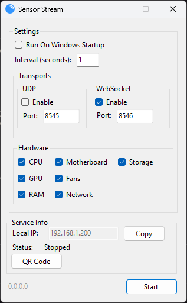

#  Sensor Stream

A real-time hardware monitoring tool that streams PC sensor data through WebSocket or UDP. 🌐

| Application Preview | Key Features |
|:---:|:---|
|  | • **Real-time Hardware Monitoring** 🖥️   - CPU (temperature, load, clock speeds, power) 🔥   - GPU (NVIDIA, AMD, Intel) 🎮   - RAM/Memory usage 💾   - Storage devices 📦   - Network adapters 🌐   - Motherboard sensors 🛠️  • **Multiple Transport Options** 🚀   - WebSocket server (default port 8546) 🔗   - UDP datagrams (default port 8545) 📡  • **Easy Integration** 🤝   - Simple command format: `component/index/value`   - JSON responses 📜   - Real-time updates ⏱️  • **Configurable** ⚙️   - ~~Customizable update intervals~~ (Updating upon request now) 🔄   - Selective hardware monitoring 🔍   - Port configuration 🔧 |

## WebSocket Command Interface
Connect to `ws://localhost:8546` to interact with the sensor data. 📡

### Command Format
`component/index/value`
- `component`: Hardware type (cpu, gpu, ram, memory, storage, network, motherboard)
- `index`: Component index (0-based, for multiple components of same type)
- `value`: Specific sensor value to retrieve

### Value Commands
<table>
  <tr>
    <td valign="top">

### Basic Commands
| 🗝️ | Description | Command |
|:---:|:-----------|:-------:|
| 🌡️ | CPU Package Temperature | `cpu/0/temperature/package` |
| 🎮 | GPU Core Temperature | `gpu/0/temperature/core` |
| 💾 | RAM Usage | `memory/0/data/memoryused` |
| 🌐 | Network Download Speed | `network/1/throughput/downloadspeed` |    
| 🔧 | CPU Core 1 Load | `cpu/0/load/core1` |
| 🔥 | GPU Core Temperature | `gpu/0/temperature/core` |
| 📊 | RAM Usage | `memory/0/data/memoryused` |

</td>
<td valign="top">

### Special Commands
| 🗝️ | Description | Command |
|:---:|:-----------|:-------:|
| 📋 | Lists all available components | `system/components` |
| 🔍 | Detailed list of all components and their sensors | `system/components/all` |
| 📊 | Lists all data for specific component | `{component}/{index}` |
| 🏷️ | Component name | `{component}/{index}/name` |
| 🔢 | Number of sensors | `{component}/{index}/sensorcount` |

</td>
  </tr>
</table>

## Using with Resonite/ProtoFlux

### Prerequisites
1. Start SensorStream on your PC 🖥️
2. Make sure WebSocket is enabled in App. (Set to desired port, default 8546) 🔗
3. In Resonite, you'll need to request host access for WebSocket connections 🔒

### Security Note
*Bark!* Remember that Resonite requires user consent for WebSocket connections! When requesting access, specify that you're connecting to SensorStream to monitor PC hardware stats. 🛡️

## Visual Guide: Setting up ProtoFlux for SensorStream

| Step 1: Basic Setup | Step 2: Connection Setup | Step 3: Message Flow |
|-------------------|------------------------|-------------------|
|  |  |  |
| Create these nodes: • WebsocketConnect • WebsocketTextMessageSender • WebsocketTextMessageReceiver • Parse Float • Float Display | Configure WebsocketConnect: • Set URI to "ws://localhost:8546" • Connect 'Connected' output to MessageSender | Connect in sequence: 1. Connect → MessageSender 2. MessageSender → MessageReceiver 3. MessageReceiver → Parse Float 4. Parse Float → Float Display |

## Installation
1. Download/clone this repository
2. Download/clone [LibreHardwareMonitorLib](https://github.com/LibreHardwareMonitor/LibreHardwareMonitor) repository and compile
3. Add references to `LibreHardwareMonitorLib.dll` and `HidSharp.dll` in this project
4. Build and run

## Dependencies
- LibreHardwareMonitorLib (hardware monitoring)
- Fleck (WebSocket server)
- Newtonsoft.Json (JSON serialization)
- HidSharp (hardware interface)

## License
MIT License

Copyright (c) 2021 Jecsham Castillo | Copyright (c) 2024 Dexy

This software is built upon the original work by Jecsham Castillo

Übersetzen
